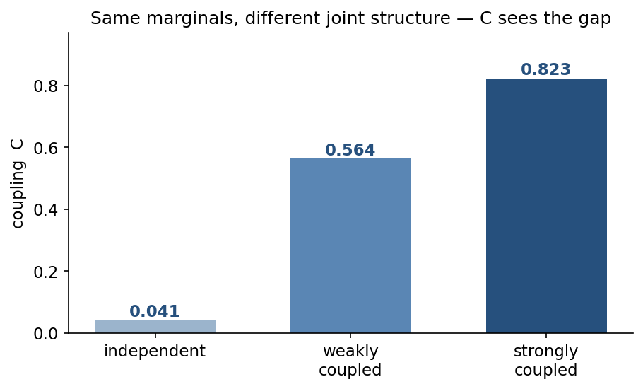

# couplnorm

**Normalized 4th-order coupling metrics and losses for generative model evaluation.**

`couplnorm` implements the normalized off-diagonal coupling diagnostic **C**, a
4th-order spectral statistic that measures *joint* coupling between Fourier modes
— structure that second-order metrics (power spectrum, two-point function) miss
by construction.

> Marginal Gaussianity does not imply joint independence. **C measures the gap.**



All three distributions above have (near-)identical per-mode marginals; a power
spectrum cannot tell them apart. C rises from ~0.04 to ~0.82 as joint 4th-order
coupling is switched on. (Reproduce with `notebooks/01_basic_usage.ipynb`.)

Given field samples, `couplnorm` computes the covariance of the per-mode spectral
energies `E_k = |φ̃_k|²` and reduces it to a single scale-free number:

```
C = ‖Σ − diag(Σ)‖_F / ‖Σ‖_F
```

`C = 0` means the spectral energies are pairwise uncorrelated (a Gaussian /
free-field signature); `C → 1` means off-diagonal coupling dominates.

## Install

```bash
pip install -e .[dev]     # from a checkout
```

Requires Python ≥ 3.10 and PyTorch ≥ 2.0.

## Quickstart

```python
import torch
from couplnorm import coupling_from_samples, CouplingMetric, CouplingLoss

# One-shot number from a batch of (B, N) real fields
phi = torch.randn(10_000, 32)
print(coupling_from_samples(phi).item())        # ~0.03  (independent modes)

# As a streaming nn.Module metric
metric = CouplingMetric(mode="running", momentum=0.02, n_modes=32 // 2 + 1)
for chunk in loader:                            # doctest: +SKIP
    metric(chunk)
print(metric.compute().item())

# As a training loss that matches a reference distribution's coupling
loss_fn = CouplingLoss.from_data(reference_data, target_type="matrix")  # doctest: +SKIP
loss = loss_fn(generated_batch)                 # doctest: +SKIP
```

## Three forms

| Object                  | Use                                                            |
| ----------------------- | ------------------------------------------------------------- |
| `coupling_from_samples` | one-line functional helper — just want the number             |
| `CouplingMetric`        | `nn.Module` metric; batch **or** streaming (running EMA) mode  |
| `CouplingLoss`          | differentiable loss: match a covariance, match a scalar C, or minimize C (DeCov-style) |

## The FFT convention (important)

For a **real** field of length `N`, the DFT is conjugate-symmetric
(`φ̃_k = φ̃*_{N−k}`), so `|φ̃_k|² = |φ̃_{N−k}|²` *exactly*. Feeding the full FFT into
C creates `N − 2` off-diagonal entries that equal diagonal entries before any
physics enters, inflating C by an analytical floor of

```
C_floor = sqrt((N − 2) / (2N − 2)) ≈ 0.7
```

`couplnorm` defaults to `real_fft=True` (uses `torch.fft.rfft`, keeping only the
`N//2 + 1` unique modes), which reflects only genuine coupling. Set
`real_fft=False` only for intrinsically complex fields. A regression test pins
the analytical floor so this convention can't silently break.

## What's in the box

```
src/couplnorm/
  coupling.py     # the metric, loss, and helpers (the contribution)
  samplers.py     # Phi4Sampler: 1D phi^4 Metropolis-Hastings reference sampler
  models/         # FourierModel, FullGaussian, PCAModel, MAF baselines
  plotting.py     # matplotlib helpers for the notebooks
notebooks/
  01_basic_usage.ipynb      # compare C across distributions
  02_reproduce_paper.ipynb  # phi^4 free vs interacting theory
  03_coupling_as_loss.ipynb # train a generator to match coupling
```

Baselines share one interface: construct, `.fit(data)` where applicable, then
`.sample(n)` returning `(n, N)` real position-space fields. The `FourierModel`
assumes marginal mode independence, so it collapses C to ≈ 0 regardless of the
target — the concrete demonstration of why C is worth measuring.

## Citation

See [`CITATION.cff`](CITATION.cff).

## License

MIT — see [`LICENSE`](LICENSE).
